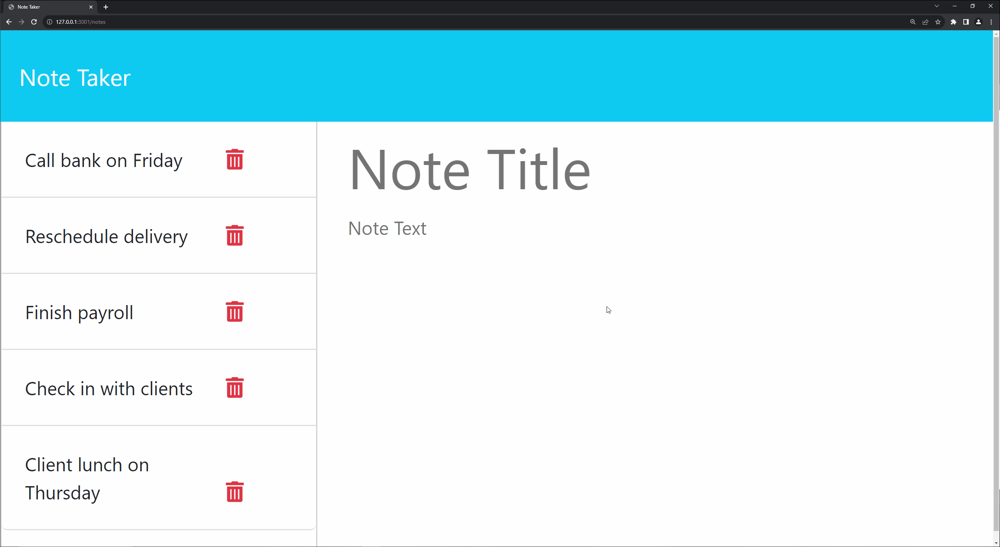

# NoteTaker

## Live Demo

## Table of Contents
- [Live Demo](#live-demo)
- [Description](#description)
- [Built With](#built-with)
- [Features](#features)
- [Getting Started](#getting-started)
- [Contributing](#contributing)
- [Contact](#contact)
- [License](#license)

## Description

1. **Scroll Down to ## The Process**

The NoteTaker project is a full-stack application designed for efficient note management. It integrates a Node.js and Express.js backend with an existing frontend, enabling users to create, view, and delete notes. This project underscores key backend development aspects and debugging.

## Built With
- Node.js
- Express.js
- HTML, CSS, JavaScript (Frontend)

## Features
- CRUD operations for notes.
- Data persistence through JSON file storage.
- Frontend-backend integration.
- Error handling and server response management.

## The Process

This project mainly focused on debugging and connecting back end functionality to a pre exsisting Front-end files. Nothing Crazy, just needed to go through the process. I will explain more below.  

1. **Static File Serving**: The initial problem was with the static file serving. I started by ensuring that the Express.js server was set up to serve static files. This meant configuring the server to deliver the appropriate public files to the user.

2. **API Endpoint Creation**: Next, I Focused on the API Endpoints, Most of witch just had to be GET and POST, although i added a DELETE but we will get to that later. I ran into some path issues but i re arranged some of the files in the front end and changed the routes and voila! 

3. **Implementing DELETE Functionality**: The front end had a delete feature but it was connected to the backend. So of ofourse we connected it, using uuids , i was able to assign each note a specific id and then call on that id to be deleted from the db. 

   

   *This snippet showcases the DELETE route used to remove a specific note. We ensured the correct extraction of note IDs and proper handling of file operations.*

4. **Error Handling**: I added some error handling but nothign crazy, just enough to see if ther was any JSON issues res.status(500)ish stuff.

If you have managed to read this far i really appreciate it. THanks for letting me showcase my skills to you, Happy Coding! 

## Contact
- GitHub: [Maximilian93B](https://github.com/Maximilian93B)
- Email: [max.md.bosch@gmail.com](mailto:max.md.bosch@gmail.com)

## License
This project is licensed under the MIT license.

